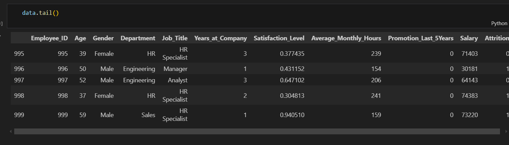
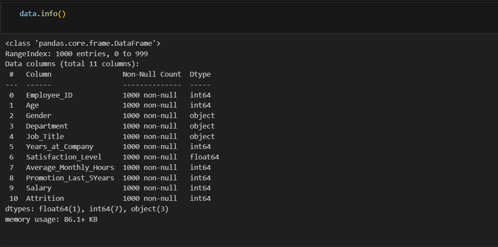
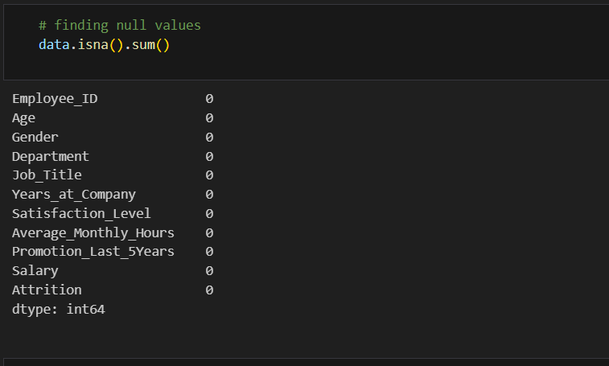
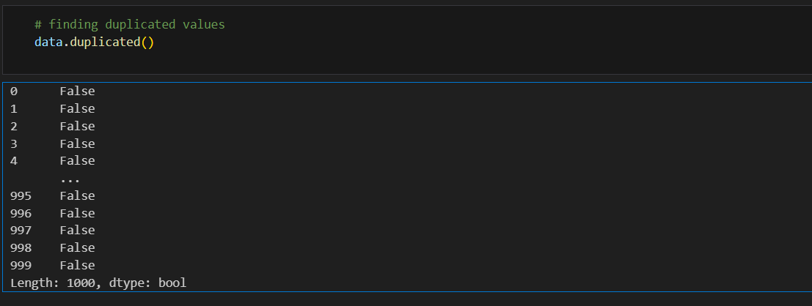
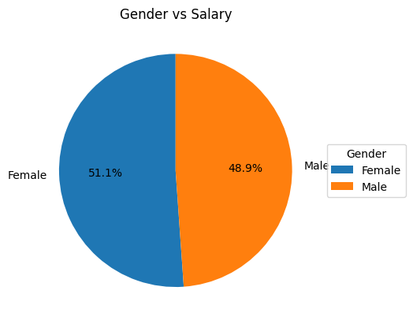
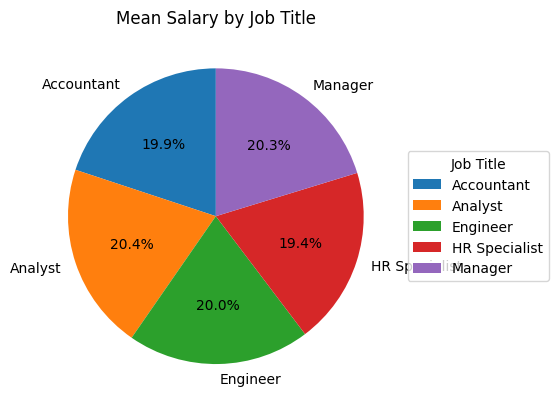
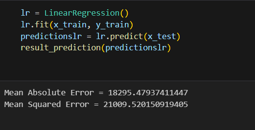
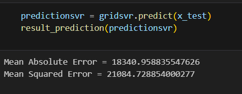
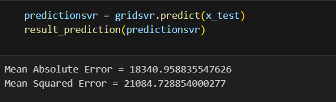
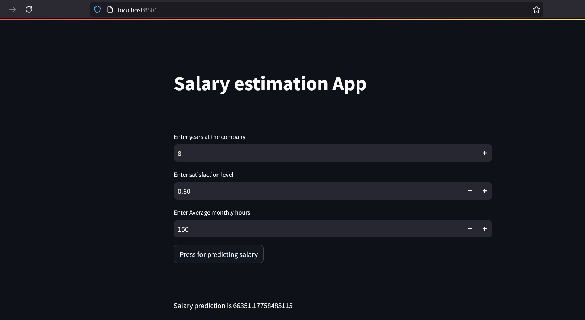

## We evaluate a salary dataset with Linear Regression, Random Forest and Support Vector Regression (SVR), ending with a simple deployment in Streamlit

## We evaluated a small salary dataset, when the amount of data is not important a concrete way to get accuracy is to evaluate with several models, here we did it with linear regression, random forest and support vector regression (SVR), in the end we chose one to implement it with Streamlit, we used Joblib to save and it brings the scaling and modeling, thus we avoid doing it during deployment.

### EDA Process

## Finding out insights

## Modeling and evaluating: Linear Regression, Support Vector Regression and Random Forest

**We choose Linear Regression Model, since this got the minimus values for Mean Absolute Erro and Mean Squared Error**

## Finally we deploy it with Streamlit: you can run it: streamlit run app.py

**Author**
------------

* Renar Zamora - renarzamora@gmail.com

**Tools**
----------------

* Python 3.11, Visual Studio Code, Streamlit, Scikit Learn, Matplotlib, Joblib, Pandas and Numpy